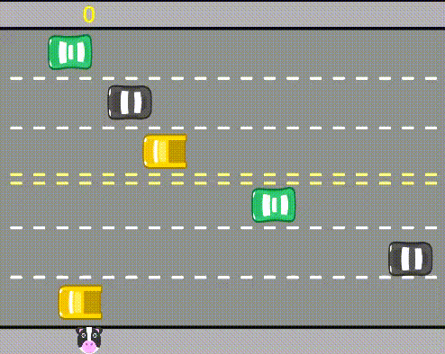

# Atravessando

Ajude a vaquinha a atravessar a rua sem colidir com o carro!

### Como funciona

* Chegando do outro lado da estrada você ganha um ponto 😁
* Porém se você colidir com um carro e tiver 1 ponto ou mais você perde ponto. 😭

### Bora jogar

Acesse o link abaixo e divirta-se: 🎊🎉

##### https://editor.p5js.org/Jackeline-Bomfim/full/b581TfsNL

Esse jogo foi desenvolvido junto ao professor no curso de lógica de programação II da Alura, para aprendermos a usar condições e laço de repetição.

### linguagens utilizadas

* HTML
* CSS
* JAVASCRIPT
